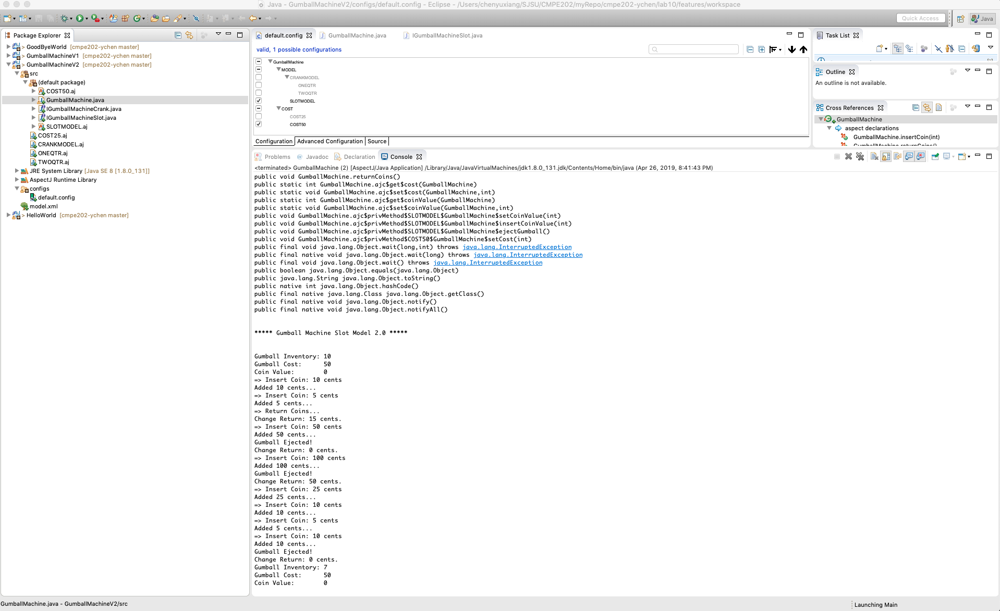
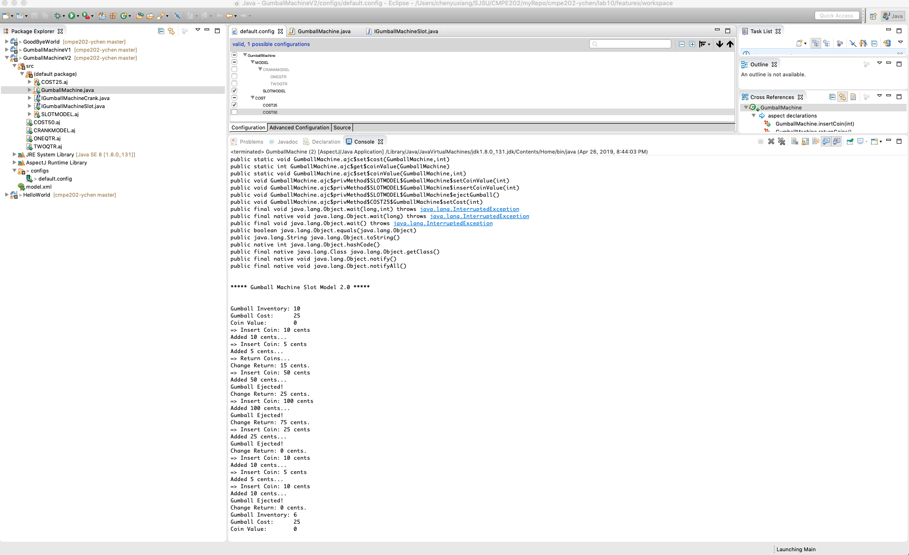
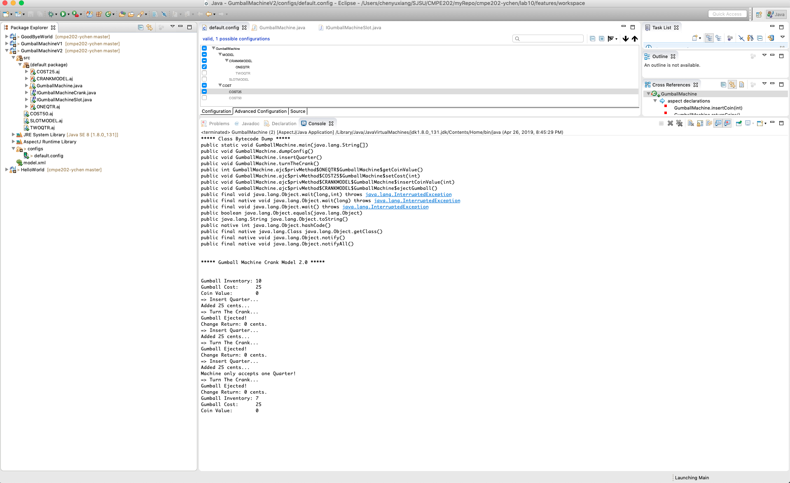
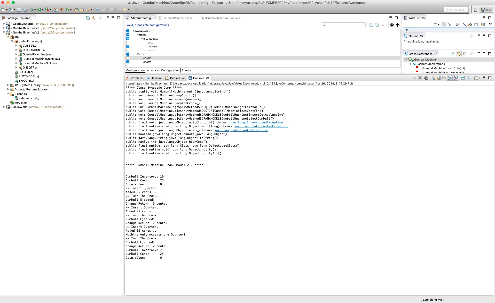

# Lab 10

It was really easy to generate different kinds of gumball machines with simple clicks of changing the config file. 

AOP enables the code maintainability without actually changing the code. It is really convenient.

