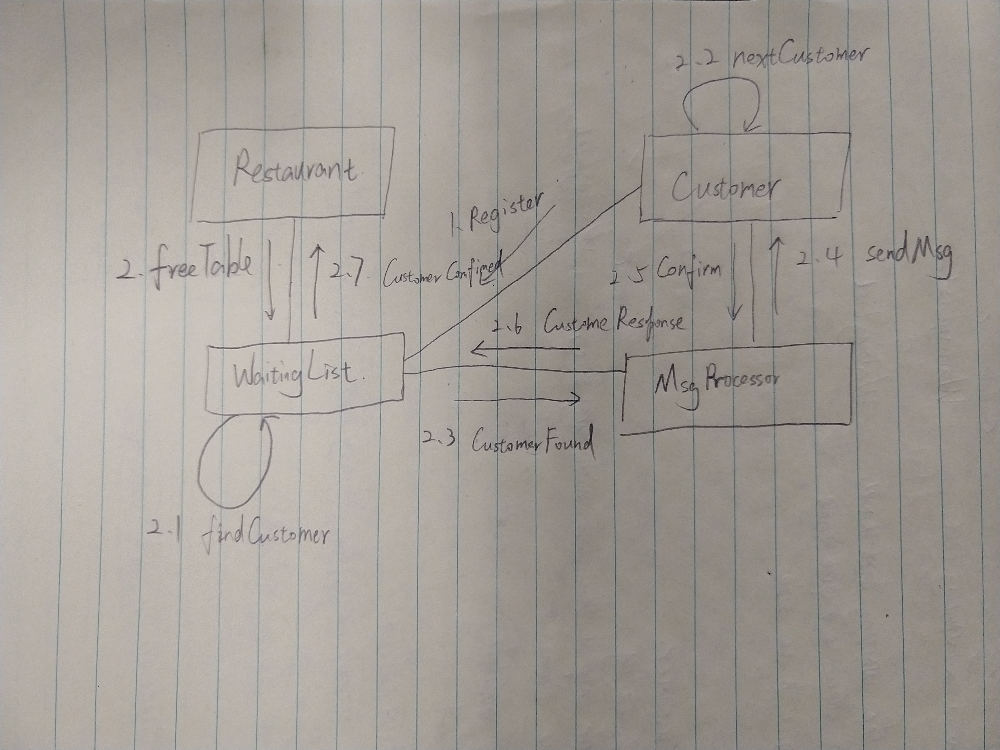

# CmpE 202 Lab 4

## CRC
<table>
    <tr>
        <th colspan="2">Restaurant</th>
    </tr>
    <tr>
        <th>Responsibility</th>
        <th>Collaborator</th>
    </tr>
    <tr>
        <td>Maintain a waiting List.</td>
        <td>WaitingList</td>
    </tr>
    <tr>
        <td>Let the waiting list know, when there is a free table with its size.</td>
        <td>WaitingList</td>
    </tr>
</table>

<table>
    <tr>
        <th colspan="2">Customer</th>
    </tr>
    <tr>
        <td>Register self in WaitingList</td>
        <td>WaitingList</td>
    </tr>
    <tr>
        <td>Pass available table to next customer, if either leave or size doesn't fit.</td>
        <td>Customer</td>
    </tr>
    <tr>
        <td>Send response back to MsgProcessor</td>
        <td>MsgProcessor</td>
    </tr>
</table>

<table>
    <tr>
        <th colspan="2">WaitingList</th>
    </tr>
    <tr>
        <td>Add Customer into the WaitingList, when customers register.</td>
        <td>Customer</td>
    </tr>
    <tr>
        <td>Form a chain of handler, when customer enters the waiting list.</td>
        <td>Customer</td>
    </tr>
    <tr>
        <td>Find the next available customer</td>
        <td>Customer</td>
    </tr>
    <tr>
        <td>Remove customer, from the waiting list, when the customer either confirm or leave.</td>
        <td>MsgProcessor</td>
    </tr>
    <tr>
        <td>Notify restaurant if available customer is confirmed.</td>
        <td>Restaurant</td>
    </tr>
</table>

<table>
    <tr>
        <th colspan="2">MsgProcessor</th>
    </tr>
    <tr>
        <td>Send message to customer</td>
        <td>Customer</td>
    </tr>
    <tr>
        <td>Receive response from customer</td>
        <td>Customer</td>
    </tr>
    <tr>
        <td>Let WaitingList know the customers response</td>
        <td>WaitingList</td>
    </tr>
</table>

## Collabration Diagram

## Pattern
### Explaination
I chose **Chain of Responsibility** as the design pattern for managing the waiting list of customers. Essentialy, the waiting list is an ordered list of customers, and customers may handle the table availability differently, depends on the size of the table and cusotmer's decision. So the table availability needs to be passed to the customers, in their registered order, one by one, until a customer confirms interest. 
### Roles
- **WaitingList** - Client
- **Customer** - Handler
