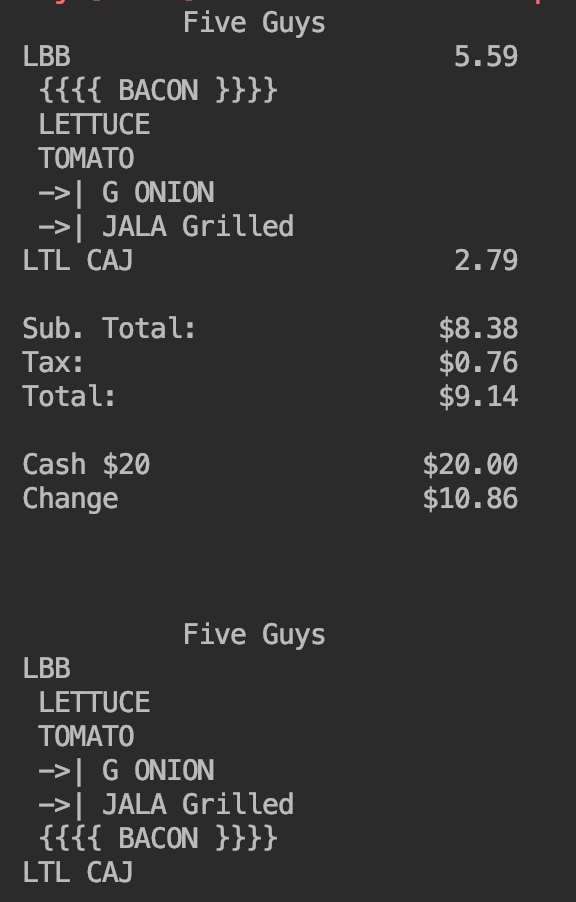

# Five Guys
For this lab I used three patterns - **Composite, Decorator** and **Strategy**.

## Comosite
Used Composite pattern to compose items with different addins. For example, burger with different toppings.

## Decorator
Used Decorator to decorate the output of addins, depends on its placing layer.

## Strategy
There are two strategy being used to make printout. One for receipt, another one for Packing slip.

## Output

